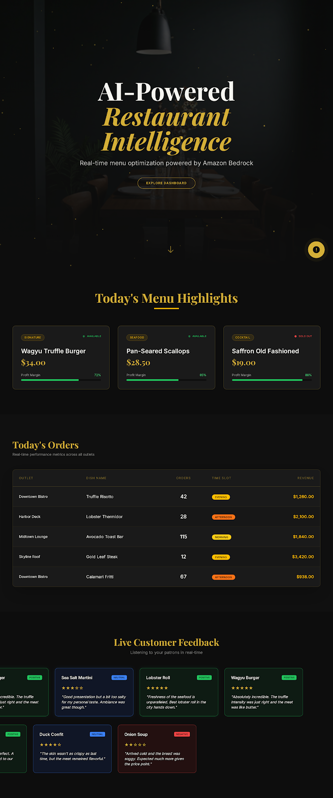

# 🍩 AI Smart Menu & Recipe Optimization Agent

An AI-powered restaurant analytics dashboard for Restaurant that uses **Amazon Bedrock (Nova Pro)** and **DynamoDB** to deliver intelligent menu optimization insights through a conversational chat interface.



## ✨ Features

- **Interactive Dashboard** — Browse menu items, order history, and customer reviews in a warm, gold-themed UI
- **AI Chat Agent** — Ask natural language questions about menu performance, and get LLM-as-Judge classified insights (⭐ STAR, 💤 SLEEPER, ⚠️ PROBLEM, 💀 DEADWEIGHT, 🚀 PROMOTE NOW)
- **Live DynamoDB Data** — All data is fetched in real-time from AWS DynamoDB tables (menu, orders, reviews)
- **Infinite Review Scroll** — Seamless CSS-animated review carousel with sentiment-based color coding
- **Canvas Particle Hero** — Animated particle background with warm amber glow

## 🏗️ Architecture

```
┌─────────────┐     ┌──────────────┐     ┌─────────────────┐
│  Next.js 14  │────▶│  FastAPI      │────▶│  DynamoDB       │
│  Frontend    │◀────│  Backend      │────▶│  (3 tables)     │
│  :3000       │     │  :8000        │     │  us-east-1      │
└─────────────┘     └──────┬───────┘     └─────────────────┘
                           │
                           ▼
                    ┌──────────────┐
                    │ Amazon Bedrock│
                    │ Nova Pro v1   │
                    └──────────────┘
```

## 📁 Project Structure

```
├── backend/
│   ├── main.py            # FastAPI app (5 endpoints)
│   ├── dynamo.py          # DynamoDB scan functions with pagination
│   ├── bedrock.py         # Bedrock Runtime invocation
│   ├── prompt.py          # LLM-as-Judge prompt builder
│   ├── requirements.txt
│   └── .env               # AWS credentials & config (not committed)
│
├── frontend/
│   ├── app/               # Next.js App Router (page, layout, globals.css)
│   ├── components/        # 9 React components
│   ├── hooks/             # 4 custom hooks (useMenuData, useOrderData, useReviewData, useChat)
│   ├── utils/api.js       # Axios API client
│   ├── tailwind.config.js # Custom warm brown/gold theme
│   └── package.json
│
├── .gitignore
└── REQUIREMENTS.md
```

## 🚀 Getting Started

### Prerequisites

- Python 3.10+
- Node.js 18+
- AWS account with:
  - 3 DynamoDB tables (menu, orders, reviews) in `us-east-1`
  - Bedrock access enabled for `amazon.nova-pro-v1:0`
  - IAM credentials with DynamoDB + Bedrock permissions

### 1. Backend Setup

```bash
cd backend
pip install -r requirements.txt
```

Create a `.env` file in `backend/`:

```env
AWS_ACCESS_KEY_ID=<your-access-key>
AWS_SECRET_ACCESS_KEY=<your-secret-key>
AWS_REGION=us-east-1
DYNAMODB_TABLE_MENU=<your-menu-table>
DYNAMODB_TABLE_ORDERS=<your-orders-table>
DYNAMODB_TABLE_REVIEWS=<your-reviews-table>
BEDROCK_MODEL_ID=amazon.nova-pro-v1:0
```

Start the server:

```bash
python main.py
```

Backend runs at `http://localhost:8000`

### 2. Frontend Setup

```bash
cd frontend
npm install
npm run dev
```

Frontend runs at `http://localhost:3000`

## 📡 API Endpoints

| Method | Endpoint | Description |
|--------|----------|-------------|
| GET | `/health` | Health check |
| GET | `/data/menu` | Fetch all menu items |
| GET | `/data/orders` | Fetch all orders |
| GET | `/data/reviews` | Fetch all reviews |
| POST | `/analyze` | Send a question to the AI agent |

## 🛠️ Tech Stack

| Layer | Technology |
|-------|-----------|
| Frontend | Next.js 14, React 18, Tailwind CSS, Framer Motion |
| Backend | FastAPI, Uvicorn, Boto3 |
| Database | Amazon DynamoDB |
| AI Model | Amazon Bedrock — Nova Pro v1 |
| Hosting | Local development |

## 📄 License

This project is for educational and demonstration purposes.
